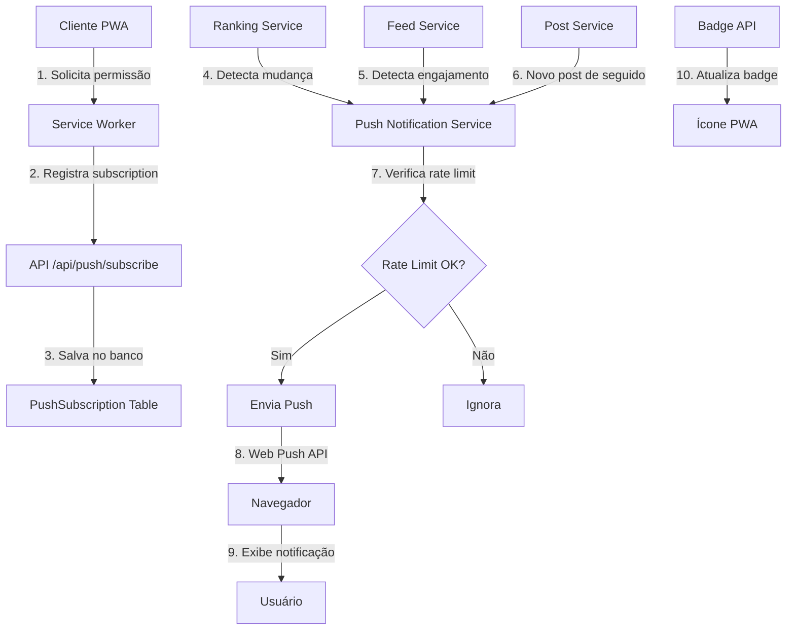

# Implementação de Notificações Push via PWA

## Visão Geral

Implementar sistema completo de notificações push para PWA com três tipos de notificações:

1. **Ranking**: Quando usuário entra no top 3 ou sobe mais de 5 posições
2. **Engajamento**: Posts da comunidade com bom engajamento nas últimas horas
3. **Following**: Posts de pessoas que o usuário segue (limitado)

Inclui badge no ícone do PWA instalado mostrando quantidade de notificações não lidas.

## Arquitetura



## UX/UI de Notificações

### Fluxo de Permissão

1. **Primeira Interação**: Usuário vê card elegante não intrusivo após algumas interações com o app
2. **Solicitação**: Card mostra benefícios das notificações com botão claro "Ativar Notificações"
3. **Permissão Concedida**: Card mostra confirmação e desaparece suavemente após 3 segundos
4. **Permissão Negada**: Card mostra instruções para ativar manualmente nas configurações
5. **Gestão**: Usuário pode gerenciar tudo na página de perfil

### Área de Gestão

- **Localização**: Seção dedicada na página `/perfil`
- **Organização**: Dividida em seções claras (Status, Preferências, Teste, Informações)
- **Feedback Visual**: Toggles com estados claros, loading durante salvamento, confirmação de mudanças
- **Acessibilidade**: Labels descritivos, contraste adequado, navegação por teclado

## Implementação

### 1. Banco de Dados

**Arquivo**: `prisma/schema.prisma`

- Criar modelo `PushSubscription` para armazenar subscriptions de push:
  - `id`, `userId`, `endpoint`, `keys` (JSON com p256dh e auth), `createdAt`, `updatedAt`
  - Índices em `userId` e `endpoint`
- Criar modelo `PushNotificationLog` para rate limiting:
  - `id`, `userId`, `type`, `sentAt`
  - Índice em `userId, sentAt` para verificar última notificação por hora
- Criar modelo `PushNotificationPreferences` para preferências do usuário:
  - `id`, `userId` (unique), `rankingEnabled`, `engagementEnabled`, `followingEnabled`, `allEnabled`, `updatedAt`
  - Valores padrão: todos habilitados (`true`)
  - Índice em `userId`

### 2. Chaves VAPID

**Arquivo**: `scripts/generate-vapid-keys.ts`

- Script para gerar chaves VAPID usando biblioteca `web-push`
- Salvar chaves públicas/privadas em variáveis de ambiente
- Adicionar ao `.env.example`: `VAPID_PUBLIC_KEY`, `VAPID_PRIVATE_KEY`, `VAPID_SUBJECT`

### 3. Service Worker

**Arquivo**: `public/sw.js` (atualizar)

- Adicionar handler `push` para receber notificações
- Adicionar handler `notificationclick` para abrir app quando clicar
- Implementar atualização de badge usando Badge API
- Manter compatibilidade com workbox existente

### 4. API de Registro de Subscription

**Arquivo**: `src/app/api/push/subscribe/route.ts`

- POST: Registrar subscription do usuário autenticado
- Validar subscription object
- Salvar no banco associado ao userId
- Criar preferências padrão se não existirem
- Retornar sucesso/erro

**Arquivo**: `src/app/api/push/unsubscribe/route.ts`

- POST: Remover subscription do usuário

**Arquivo**: `src/app/api/push/preferences/route.ts`

- GET: Retornar preferências de notificações do usuário autenticado
- PUT: Atualizar preferências de notificações
  - Aceitar `rankingEnabled`, `engagementEnabled`, `followingEnabled`, `allEnabled`
  - Validar dados
  - Salvar no banco

### 5. Serviço de Push Notifications

**Arquivo**: `src/lib/services/push-notification-service.ts`

- Classe `PushNotificationService` com métodos:
  - `sendPushNotification(userId, payload)`: Envia notificação para usuário
  - `checkRateLimit(userId)`: Verifica se pode enviar (máx 1/hora)
  - `checkPreferences(userId, type)`: Verifica se usuário tem preferência habilitada para tipo
  - `sendRankingNotification(userId, data)`: Notificação de ranking (verifica preferência)
  - `sendEngagementNotification(userId, data)`: Notificação de engajamento (verifica preferência)
  - `sendFollowingNotification(userId, data)`: Notificação de post seguido (verifica preferência)
  - `sendTestNotification(userId)`: Envia notificação de teste
- Usar biblioteca `web-push` para enviar notificações
- Tratar erros (subscription inválida, etc.)
- Respeitar preferências do usuário antes de enviar

### 6. Integração com Ranking

**Arquivo**: `src/lib/services/ranking-service.ts` (atualizar)

- No método `calculateBothRankings()` ou `calculateBothRankingsWithCheckpoint()`:
  - Após calcular ranking, comparar posição anterior com atual
  - Para cada usuário que mudou:
    - Se entrou no top 3 OU subiu mais de 5 posições → enviar notificação
  - Usar `PushNotificationService.sendRankingNotification()`

**Arquivo**: `prisma/schema.prisma` (atualizar)

- Adicionar campo `lastRankingPosition` em `UserStats` ou criar tabela `UserRankingHistory`:
  - `userId`, `period`, `year`, `month`, `position`, `updatedAt`
  - Usar para comparar posições anteriores

### 7. Notificações de Engajamento

**Arquivo**: `src/lib/services/engagement-notification-service.ts`

- Serviço que verifica posts com bom engajamento:
  - Posts criados nas últimas 2-4 horas
  - Score de engajamento > threshold (ex: 20 pontos)
  - Selecionar top 3-5 posts por período
  - Enviar para usuários que não viram o post ainda
  - Rate limit: máximo 1 notificação por hora por usuário

**Arquivo**: `src/app/api/cron/engagement-notifications/route.ts` (opcional)

- Endpoint para rodar via cron job
- Ou integrar no fluxo existente de atualização de preços

### 8. Notificações de Following

**Arquivo**: `src/lib/services/feed-service.ts` (atualizar)

- No método `createPost()`:
  - Após criar post, buscar seguidores do autor
  - Para cada seguidor:
    - Verificar rate limit
    - Selecionar aleatoriamente alguns seguidores (ex: 30% dos seguidores)
    - Enviar notificação apenas para selecionados
- Usar `PushNotificationService.sendFollowingNotification()`

### 9. Badge no Ícone PWA

**Arquivo**: `src/lib/services/badge-service.ts`

- Serviço para atualizar badge:
  - `updateBadge(userId, count)`: Atualiza badge com contador
  - Usar Badge API do navegador
  - Contar notificações não lidas da tabela `Notification`

**Arquivo**: `src/components/pwa/BadgeUpdater.tsx`

- Componente client-side que:
  - Busca contagem de notificações não lidas via API
  - Atualiza badge usando `navigator.setAppBadge(count)`
  - Atualiza periodicamente (ex: a cada 30 segundos quando app está aberto)

**Arquivo**: `src/app/api/notifications/badge/route.ts`

- GET: Retorna contagem de notificações não lidas do usuário autenticado

### 10. Componente de Permissão com UX Intuitiva

**Arquivo**: `src/components/pwa/PushNotificationPrompt.tsx`

- Componente elegante para solicitar permissão de notificação:
  - **Design**: Card/banner não intrusivo com ícone de sino, título e descrição
  - **Estados**:
    - Não solicitado: Mostrar card com botão "Ativar Notificações"
    - Solicitando: Mostrar loading/spinner
    - Permitido: Mostrar confirmação e esconder após 3 segundos
    - Bloqueado: Mostrar mensagem com link para configurações do navegador
    - Não suportado: Esconder componente
  - **Funcionalidades**:
    - Verificar se já tem permissão ao montar
    - Botão primário para solicitar permissão
    - Após permissão, registrar subscription automaticamente
    - Botão secundário "Agora não" para fechar temporariamente
    - Persistir escolha do usuário (não mostrar novamente se recusou)
  - **UX**:
    - Aparecer após usuário interagir com app (ex: após 2-3 ações)
    - Não bloquear conteúdo
    - Animações suaves de entrada/saída
    - Responsivo para mobile e desktop

**Arquivo**: `src/app/layout.tsx` (atualizar)

- Adicionar `PushNotificationPrompt` ao layout (não intrusivo)

### 11. Área de Gestão de Notificações

**Arquivo**: `src/components/notifications/NotificationSettings.tsx`

- Componente completo de configurações de notificações:
  - **Seção de Status**:
    - Indicador visual se notificações estão ativadas/desativadas
    - Status da permissão do navegador (permitido/bloqueado)
    - Botão para ativar/desativar todas as notificações
  - **Seções de Preferências**:
    - Toggle para "Notificações de Ranking"
      - Descrição: "Receba notificações quando entrar no top 3 ou subir mais de 5 posições"
    - Toggle para "Notificações de Engajamento"
      - Descrição: "Receba notificações sobre posts populares da comunidade"
    - Toggle para "Notificações de Seguidos"
      - Descrição: "Receba notificações sobre novos posts de pessoas que você segue"
  - **Seção de Teste**:
    - Botão "Enviar Notificação de Teste" para verificar funcionamento
  - **Seção de Informações**:
    - Explicação sobre rate limiting (máx 1/hora)
    - Link para ajuda/documentação
  - **Design**:
    - Usar componentes UI existentes (Switch, Card, etc.)
    - Layout limpo e organizado
    - Feedback visual ao alterar preferências
    - Loading states durante salvamento

**Arquivo**: `src/app/(main)/perfil/page.tsx` (atualizar)

- Adicionar `NotificationSettings` como nova seção na página de perfil
- Posicionar após `ProfileInfo` e antes de `PasswordManager`
- Mostrar apenas para usuários autenticados

**Arquivo**: `src/lib/hooks/usePushNotificationPreferences.ts`

- Hook customizado para gerenciar preferências:
  - `useQuery` para buscar preferências
  - `useMutation` para atualizar preferências
  - Cache e invalidação automática
  - Estados de loading/error

### 11. Migração do Banco

**Arquivo**: `prisma/migrations/XXXXXX_add_push_notifications/migration.sql`

- Criar tabelas `PushSubscription` e `PushNotificationLog`
- Adicionar campo `lastRankingPosition` ou criar `UserRankingHistory`
- Criar índices apropriados

## Dependências

- `web-push`: Para enviar notificações push
- Atualizar `package.json` com nova dependência

## Variáveis de Ambiente

Adicionar ao `.env`:

- `VAPID_PUBLIC_KEY`: Chave pública VAPID
- `VAPID_PRIVATE_KEY`: Chave privada VAPID  
- `VAPID_SUBJECT`: Email ou URL do serviço (ex: `mailto:admin@holdarena.com`)

## Fluxo de Notificações

1. **Ranking**: Quando ranking é recalculado → compara posições → envia push
2. **Engajamento**: Verificação periódica (via cron ou integrado) → seleciona posts → envia push
3. **Following**: Quando post é criado → busca seguidores → seleciona alguns → envia push

## Rate Limiting

- Máximo 1 notificação por hora por usuário (verificado via `PushNotificationLog`)
- Badge atualizado a cada 30 segundos quando app está aberto
- Badge limpo quando usuário visualiza notificações

## Compatibilidade e Migração para Usuários Existentes

### Service Worker

**Arquivo**: `src/components/pwa/ServiceWorkerRegistration.tsx` (atualizar)

- **Atualização Automática**: O service worker já verifica atualizações a cada hora
- Quando novo `sw.js` for deployado, será baixado automaticamente
- Usuários existentes receberão o novo service worker na próxima visita ou após 1 hora
- **Importante**: Manter compatibilidade com código existente do workbox

**Arquivo**: `public/sw.js` (atualizar)

- Adicionar handlers de push **sem quebrar** funcionalidades existentes do workbox
- Usar `self.addEventListener('push', ...)` de forma não conflitante
- Manter todos os handlers existentes (cache, offline, etc.)

### Detecção de Capacidades

**Arquivo**: `src/lib/utils/push-notification-support.ts`

- Criar utilitário para verificar suporte:
  - `checkPushSupport()`: Verifica se navegador suporta Push API
  - `checkBadgeSupport()`: Verifica se navegador suporta Badge API
  - `checkServiceWorkerSupport()`: Verifica se service worker está ativo
  - `isPWAInstalled()`: Verifica se PWA está instalado (standalone mode)
- Retornar objeto com flags de suporte para usar nos componentes

**Arquivo**: `src/components/pwa/PushNotificationPrompt.tsx` (atualizar)

- Verificar suporte antes de mostrar prompt
- Se service worker não estiver pronto, aguardar antes de solicitar permissão
- Se PWA instalado, mostrar mensagem específica: "Ative notificações para receber atualizações mesmo quando o app estiver fechado"
- Se não instalado, mensagem genérica sobre notificações

### Migração de Usuários Existentes

**Arquivo**: `src/components/pwa/PushNotificationPrompt.tsx` (atualizar)

- **Usuários com PWA instalado**:
  - Mostrar prompt destacando benefícios (notificações mesmo com app fechado)
  - Verificar se já tem subscription antes de mostrar
  - Se já tem subscription mas permissão foi revogada, mostrar botão para reativar
- **Usuários sem PWA instalado**:
  - Prompt padrão de notificações
  - Opcionalmente sugerir instalação do PWA também

**Arquivo**: `src/components/notifications/NotificationSettings.tsx` (atualizar)

- **Seção de Diagnóstico**:
  - Mostrar status do service worker (ativo/inativo)
  - Mostrar status da permissão do navegador
  - Mostrar se tem subscription registrada
  - Botão "Verificar e Atualizar" para forçar atualização do service worker
  - Mensagens de ajuda específicas para cada estado

### Badge API - Compatibilidade

**Arquivo**: `src/lib/services/badge-service.ts` (atualizar)

- Verificar suporte antes de usar:
  ```typescript
  if ('setAppBadge' in navigator) {
    await navigator.setAppBadge(count);
  }
  ```

- **Navegadores que suportam**: Chrome/Edge (Android/Desktop), Safari (iOS 16.4+)
- **Fallback**: Se não suportar, simplesmente não mostrar badge (não quebra funcionalidade)
- Logar aviso em console se tentar usar em navegador sem suporte

**Arquivo**: `src/components/pwa/BadgeUpdater.tsx` (atualizar)

- Verificar suporte antes de tentar atualizar
- Se não suportar, componente não faz nada (silent fail)

### Fluxo para Usuários Existentes

1. **Usuário abre app** (já instalado):

   - Service worker verifica atualização automaticamente
   - Se houver nova versão, baixa em background
   - Na próxima recarga, novo service worker ativa com handlers de push

2. **Usuário vê prompt de notificações**:

   - Componente verifica se já tem subscription
   - Se não tem, mostra prompt elegante
   - Se tem mas permissão foi revogada, mostra opção para reativar

3. **Usuário ativa notificações**:

   - Solicita permissão do navegador
   - Registra subscription no banco
   - Badge começa a funcionar (se suportado)

4. **Usuário gerencia preferências**:

   - Acessa página de perfil → Configurações de Notificações
   - Vê status completo e pode ajustar preferências

### Verificações de Compatibilidade

**Arquivo**: `src/app/api/push/subscribe/route.ts` (atualizar)

- Validar que subscription object está completo
- Verificar se service worker está ativo antes de salvar
- Retornar erro claro se navegador não suporta

**Arquivo**: `src/lib/services/push-notification-service.ts` (atualizar)

- Antes de enviar notificação, verificar:
  - Se usuário tem subscription válida
  - Se subscription ainda está ativa (endpoint válido)
  - Se preferências permitem envio
- Se subscription inválida, remover do banco automaticamente
- Logar erros mas não quebrar fluxo principal

## Testes

- Testar registro de subscription
- Testar envio de notificação manual
- Testar rate limiting
- Testar badge em diferentes navegadores
- Testar notificações em diferentes cenários (ranking, engajamento, following)
- **Testar com PWA já instalado**: Verificar que service worker atualiza corretamente
- **Testar migração**: Usuário existente recebe prompt e pode ativar notificações
- **Testar compatibilidade**: App funciona normalmente mesmo sem suporte a push/badge
- **Testar fallbacks**: Verificar que funcionalidades não quebram em navegadores sem suporte