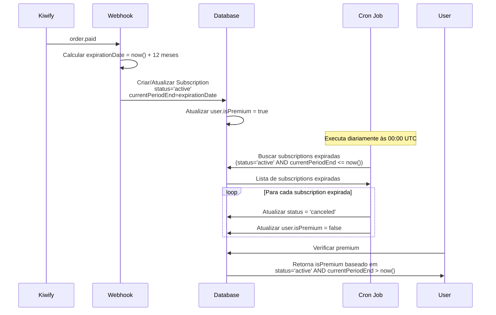

# Sistema de Expiração Premium de 12 Meses

## Data: 09/01/2026

## Objetivo

Implementar sistema onde assinaturas premium têm validade de 12 meses a partir do pagamento confirmado, com cancelamento automático quando expiradas.

## Funcionamento

### 1. Ativação da Assinatura

Quando um pagamento é confirmado via webhook do Kiwify (`order.paid` ou `order.completed`):

- O sistema calcula automaticamente a data de expiração como **12 meses a partir da data do pagamento**
- A subscription é criada/atualizada com:
  - `status: 'active'`
  - `currentPeriodEnd: data_atual + 12 meses`
  - `isPremium: true` no usuário

**Importante**: A data de expiração é sempre calculada como 12 meses a partir do momento do pagamento, independentemente do que vier no webhook do Kiwify.

### 2. Verificação de Status Premium

O sistema verifica o status premium em múltiplos pontos:

- **Se existe subscription**: Usa apenas a data de expiração (`currentPeriodEnd`) para determinar se o usuário é premium
  - Premium = `status === 'active'` AND `currentPeriodEnd !== null` AND `currentPeriodEnd > now()`
- **Se não existe subscription**: Usa `user.isPremium` como fallback (legado/cache)

**Locais onde a verificação ocorre**:
- `src/lib/auth/server.ts` - `getServerSession()`
- `src/app/api/auth/me/route.ts` - Endpoint de autenticação
- `src/app/api/leads/route.ts` - Verificação de leads convertidos

### 3. Expiração Automática

O endpoint `/api/subscriptions/expire` é responsável por cancelar automaticamente assinaturas expiradas:

- Busca todas as subscriptions com `status = 'active'` e `currentPeriodEnd <= now()`
- Para cada subscription expirada:
  - Atualiza `status = 'canceled'`
  - Atualiza `user.isPremium = false`
- Retorna estatísticas da execução

**Recomendação**: Executar diariamente (1x por dia às 00:00 UTC)

## Configuração do Cron Job

### Variáveis de Ambiente

O endpoint usa a mesma variável de ambiente do cron de preços:

```env
CRON_SECRET_TOKEN=seu_token_seguro_aqui
```

### Configuração do Cron

#### Opção 1: Cron do Sistema (Linux/Mac)

```bash
crontab -e
```

Adicione a linha (executa diariamente às 00:00 UTC):
```cron
0 0 * * * curl -X POST https://seu-dominio.com/api/subscriptions/expire -H "Authorization: Bearer SEU_TOKEN_AQUI"
```

#### Opção 2: Vercel Cron Jobs

No arquivo `vercel.json`:
```json
{
  "crons": [
    {
      "path": "/api/prices/update",
      "schedule": "*/15 * * * *"
    },
    {
      "path": "/api/subscriptions/expire",
      "schedule": "0 0 * * *"
    }
  ]
}
```

#### Opção 3: Serviços Externos

- **EasyCron**: https://www.easycron.com/
- **Cron-Job.org**: https://cron-job.org/
- **GitHub Actions**: Use workflows do GitHub

### Exemplo de Requisição

```bash
curl -X POST https://seu-dominio.com/api/subscriptions/expire \
  -H "Authorization: Bearer SEU_TOKEN_AQUI" \
  -H "Content-Type: application/json"
```

### Resposta Esperada

```json
{
  "success": true,
  "expiredCount": 5,
  "totalFound": 5,
  "executedAt": "2026-01-09T00:00:00.000Z"
}
```

Em caso de erros:
```json
{
  "success": true,
  "expiredCount": 3,
  "totalFound": 5,
  "errors": [
    "Erro ao expirar subscription abc-123: ...",
    "Erro ao expirar subscription def-456: ..."
  ],
  "executedAt": "2026-01-09T00:00:00.000Z"
}
```

## Estrutura do Banco de Dados

### Model Subscription

```prisma
model Subscription {
  id               String    @id @default(uuid())
  userId           String    @unique
  kiwifyId         String?   @unique
  kiwifyOrderId    String?   @unique
  status           String    // 'active' | 'canceled'
  currentPeriodEnd DateTime? // Data de expiração (12 meses após pagamento)
  createdAt        DateTime  @default(now())
  updatedAt        DateTime  @updatedAt
  
  @@index([status, currentPeriodEnd]) // Índice composto para otimizar busca de expiradas
}
```

### Índices

Foi adicionado um índice composto `[status, currentPeriodEnd]` para otimizar a query que busca subscriptions expiradas no endpoint de expiração.

## Fluxo Completo



## Segurança

- O endpoint `/api/subscriptions/expire` é protegido por token Bearer
- Usa o mesmo `CRON_SECRET_TOKEN` do endpoint de preços
- Token deve ser mantido em segredo
- Use HTTPS em produção

## Monitoramento

Recomenda-se monitorar:
- Número de subscriptions expiradas (`expiredCount`)
- Erros retornados no array `errors` (se houver)
- Data/hora da execução (`executedAt`)

## Troubleshooting

### Erro 401 (Não Autorizado)
- Verifique se o token está correto
- Confirme que o header `Authorization: Bearer TOKEN` está sendo enviado

### Erro 500 (Erro Interno)
- Verifique os logs do servidor
- Confirme que o banco de dados está acessível
- Verifique se há subscriptions com dados inconsistentes

### Assinaturas não estão expirando
- Verifique se o cron job está configurado corretamente
- Confirme que o cron está sendo executado (verificar logs)
- Verifique se `currentPeriodEnd` está sendo definido corretamente no webhook

## Arquivos Modificados

1. `src/app/api/webhooks/kiwify/route.ts` - Cálculo de 12 meses no pagamento
2. `src/app/api/subscriptions/expire/route.ts` - **NOVO** - Endpoint de expiração
3. `src/lib/auth/server.ts` - Verificação de premium baseada em data
4. `src/app/api/auth/me/route.ts` - Verificação de premium baseada em data
5. `src/app/api/leads/route.ts` - Verificação de premium baseada em data
6. `prisma/schema.prisma` - Adição de índice composto
7. `prisma/migrations/20260109165446_add_index_subscription_status_current_period_end/migration.sql` - **NOVO** - Migration

